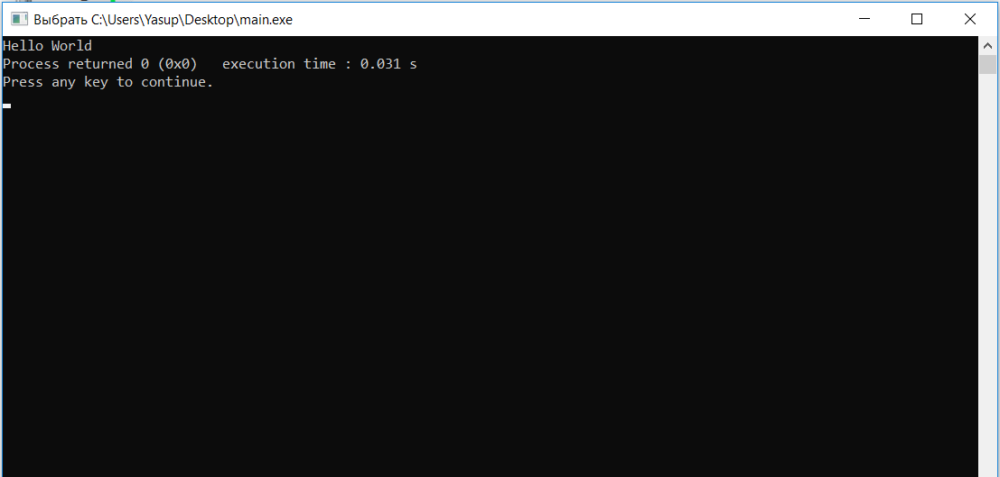
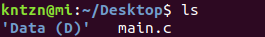
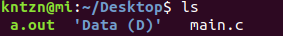

<h1> Начало начал </h1>

Салам-поплам. Это, по сути, разбор полетов по Основам программирования.

Самый главный вопрос: 
Где писать-то это всё?

Ответ очень простой. Если пользуетесь Шиндоусом, то качайте CodeBlocks. Настоятельно не рекомендую качать MS Visual Studio, так как вам еще придется её методом проб и ошибок настраивать. А пока вы этого не сделаете, она будет очень непослушной девочкой. 
Просто качаете CodeBlocks отсюда: https://www.fosshub.com/Code-Blocks.html?dwl=codeblocks-17.12mingw-setup.exe. Простая как пробка, в которой есть всё, что вам пока что нужно. Устанавливаете, запускаете.

Первое, что появится перед вами предложение ассоциировать все файлы Си и С++ с CodeBlocks. Выбираем последнее:

Создаем свой первый файл:

Открывается белая пустая область, где код и пишут. Пишем то, что хотим, нажимаем на "Собрать и запустить":

Открется меню сохранения файла, сохраните куда душе угодно, лишь бы найти потом.

Если у вас что-то с программой не так, то она не соберется. Вместо этого она отобразит в нижнем окне ошибки, которые вам надо исправить. Если же всё ок, то она запустится и откроется консоль в которой мы и будем что-то вводить - выводить:

Когда всё получится, перенесите файл на флешку и запилите для него отчет. Вот и всё.

 

<h1>Если же вы под линуксом</h1> 
- пишите хоть в блокноте. Главное здесь - сохранить его в формате *.c* После того, как всё срослось, вы что-то написали, надо это собрать. Нажатие **Ctrl + Alt + T** открывает терминал. Собственно, именно с такой штукой мы работали на семинаре по информатике. Используются те же команды - **pwd, ls, cd, cp...** Изначально вы в каталоге /home. Вероятнее всего, файл у вас лежит на рабочем столе. При помощи 

<code>cd Desktop</code>
 
Вы перейдете в рабочий стол. При помощи <code>ls</code> можно убедиться, что ваш файл в вашей директории:

В моём случае текстовый файл с кодом - **main.c**

При помощи команды <code>cc [имя файла]</code> ваш файл компилируется, превращаясь из текста в машинный код, который будет выполняться:

**Здесь вывод результата компиляции, есть предупреждения, но ошибок нет, они подсветились бы красным**

Ну хорошо, мы что-то там скомпилировали, что дальше-то? Где программа?
Снова пишем <code>ls</code> Чтобы с радостью обнаружить наш новоиспеченный файл **a.out**:

Чтобы запустить нашу программу, достаточно просто написать <code>./[имя файла]</code> В нашем случае, его имя - a.out

И мы получили всё тот же результат работы программы только уже в терминале Ubuntu.

